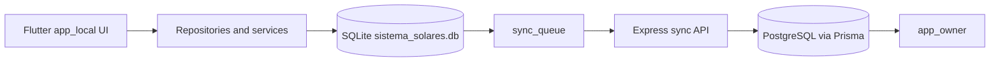
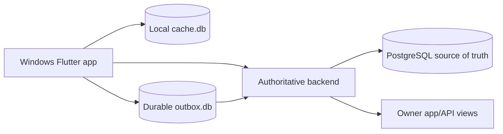

# Sistema Solares Architecture

## Current Architecture

Current operational source:

```text
app_local + SQLite sistema_solares.db
```

The local Flutter desktop app owns most business workflows today: clients, lots, sales, installments, payments, backups, documents, sync queue, and local users.

Current cloud backend:

```text
Express + TypeScript + Prisma + PostgreSQL
```

The backend receives sync data and powers owner/API surfaces. Current cloud data is not authoritative enough for production.

CURRENT SECURITY GAP - REQUIRED BEFORE CLOUD-AUTHORITATIVE CUTOVER: backend sync routes currently do not appear to be mounted with `authGuard` or `syncGuard`. Current sync must not be treated as production-authoritative until route authorization is implemented and verified.



## Target Architecture

PostgreSQL cloud becomes the authoritative business source.

Backend owns:

- business validation
- financial rules
- transactions
- idempotency
- concurrency protection
- permissions

Windows local storage becomes:

- cache
- durable offline outbox
- device state
- config
- logs
- support and recovery files



## Single Company Boundary

Sistema Solares is SINGLE COMPANY.

Existing `Company`, `companyId`, and `tenantKey` currently participate in backend unique constraints, sync resolution, status counts, batches, and reminders.

Document them as:

```text
FIXED SINGLE-COMPANY NAMESPACE - LEGACY CURRENT IMPLEMENTATION
```

Do not remove them in documentation or implementation phases unless explicitly approved.

## Known Gaps

Known target cloud gaps:

- Sale incomplete
- Payment incomplete
- Installment relational integrity incomplete
- Users incomplete
- RBAC absent/incomplete
- business configuration incomplete
- financial parameters absent/incomplete
- missing strong FK/unique constraints
- server financial ownership incomplete
- sync architecture not authoritative

## Source Boundaries

Product app boundaries:

- `app_local`: Windows administrative app. Do not touch for owner mobile UX changes unless explicitly approved.
- `app_owner`: owner's mobile app for Android APK and iPhone builds. It opens directly to `Resumen` using a configured/stored owner session and must not expose visible email/password login UI.

Current local source files:

- `app_local/lib/core/database/app_database.dart`
- `app_local/lib/core/database/database_schema.dart`
- `app_local/lib/features/*/data/*repository.dart`
- `app_local/lib/repositories/*_sync_repository.dart`
- `app_local/lib/services/sync/*`

Current backend source files:

- `backend/src/app.ts`
- `backend/src/routes/sync.routes.ts`
- `backend/prisma/schema.prisma`

Target work must move authority from local repositories to backend transactions without losing current business behavior.
