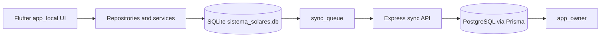
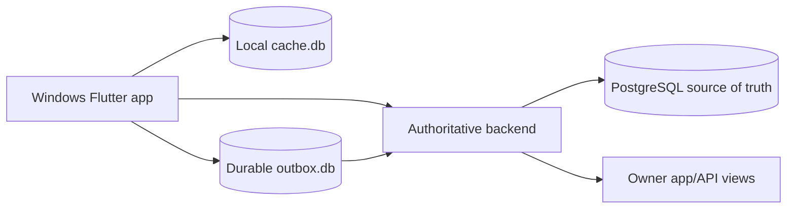

# Sistema Solares Architecture

## Current Architecture

Current operational source:

```text
app_local + SQLite sistema_solares.db
```

The local Flutter desktop app owns most business workflows today: clients, lots, sales, installments, payments, backups, documents, sync queue, and local users.

Current cloud backend:

```text
Express + TypeScript + Prisma + PostgreSQL
```

The backend receives sync data and powers owner/API surfaces. Current cloud data is not authoritative enough for production.

CURRENT SECURITY GAP - REQUIRED BEFORE CLOUD-AUTHORITATIVE CUTOVER: backend sync routes currently do not appear to be mounted with `authGuard` or `syncGuard`. Current sync must not be treated as production-authoritative until route authorization is implemented and verified.


```mermaid
flowchart LR
  UI[Flutter app_local UI] --> Repo[Repositories and services]
  Repo --> SQLite[(SQLite sistema_solares.db)]
  SQLite --> Queue[sync_queue]
  Queue --> API[Express sync API]
  API --> PG[(PostgreSQL via Prisma)]
  PG --> Owner[app_owner]
```

## Target Architecture

PostgreSQL cloud becomes the authoritative business source.

Backend owns:

- business validation
- financial rules
- transactions
- idempotency
- concurrency protection
- permissions

Windows local storage becomes:

- cache
- durable offline outbox
- device state
- config
- logs
- support and recovery files


```mermaid
flowchart LR
  LocalUI[Windows Flutter app] --> Backend[Authoritative backend]
  Backend --> PG[(PostgreSQL source of truth)]
  LocalUI --> Cache[(Local cache.db)]
  LocalUI --> Outbox[(Durable outbox.db)]
  Outbox --> Backend
  Backend --> Owner[Owner app/API views]
```

## Single Company Boundary

Sistema Solares is SINGLE COMPANY.

Existing `Company`, `companyId`, and `tenantKey` currently participate in backend unique constraints, sync resolution, status counts, batches, and reminders.

Document them as:

```text
FIXED SINGLE-COMPANY NAMESPACE - LEGACY CURRENT IMPLEMENTATION
```

Do not remove them in documentation or implementation phases unless explicitly approved.

## Known Gaps

Known target cloud gaps:

- Sale incomplete
- Payment incomplete
- Installment relational integrity incomplete
- Users incomplete
- RBAC absent/incomplete
- business configuration incomplete
- financial parameters absent/incomplete
- missing strong FK/unique constraints
- server financial ownership incomplete
- sync architecture not authoritative

## Source Boundaries

Product app boundaries:

- `app_local`: Windows administrative app. Do not touch for owner mobile UX changes unless explicitly approved.
- `app_owner`: owner's mobile app for Android APK and iPhone builds. It opens directly to `Resumen` using a configured/stored owner session and must not expose visible email/password login UI.

Current local source files:

- `app_local/lib/core/database/app_database.dart`
- `app_local/lib/core/database/database_schema.dart`
- `app_local/lib/features/*/data/*repository.dart`
- `app_local/lib/repositories/*_sync_repository.dart`
- `app_local/lib/services/sync/*`

Current backend source files:

- `backend/src/app.ts`
- `backend/src/routes/sync.routes.ts`
- `backend/prisma/schema.prisma`

Target work must move authority from local repositories to backend transactions without losing current business behavior.

## Authority model (P0 - cloud authority, current contract)

PostgreSQL (cloud) is the ONLY business authority. Local SQLite is cache,
outbox, session/config and temporary offline state. Local is NEVER authority
over `Sale`, `Installment`, `Payment`, `paidAmount`, financial status, balance,
`dueDate`, principal, interest, annulment or settlement.

Remote authoritative records MUST NOT be downgraded because a related local
table is only partially hydrated. Partial hydration is expected: `sales`,
`installments` and `payments` are downloaded as independent scopes, so one of
them can be milliseconds/seconds ahead of the others.

Concrete invariant enforced by the sync merge (`*_sync_repository.dart`,
`_reconcileSalesFromPayments`):

- The reconcile may only ADD local pending intent on top of the authoritative
  snapshot: `effectivePaid = max(localPagosTotal, authoritativePaid)`.
- `authoritativePaid` counts ONLY when the row is cloud-clean
  (`sync_status == synced`), i.e. its value came from the cloud snapshot. If the
  row carries a locally derived value, the floor is 0 so the authoritative
  correction (annulment, settlement) always wins.
- Therefore: a cloud installment delivered as `pagada` stays `pagada` even when
  its `Payment` row has not been downloaded yet (no phantom "unpay"), and the
  merge never creates a synthetic `Payment` row (no phantom payment). Payment
  history is only ever real rows.
- The final local state must be a deterministic projection of the latest
  PostgreSQL state and must NOT depend on the order in which scopes arrive
  (`installments -> payments`, `payments -> installments`, `sales` first, etc.).

Legitimate temporary exception - unsynced local intent:

- When the user registers a payment offline, local SQLite holds a provisional
  state plus the outbox intent. That provisional value is allowed to be HIGHER
  than the cloud snapshot (max rule) and the row is marked `pending` so it is
  uploaded.
- On cloud ACK the authoritative snapshot supersedes the provisional state and
  the payment is applied exactly once (identity is the record `sync_id`).
- If the backend rejects the intent, the local provisional value must be
  reconciled against PostgreSQL and the intent/error evidence preserved; local
  must never keep pretending the payment exists.

Derived vs persisted status:

- `vencida` is a DERIVED (effective) display status computed from the business
  day (`America/Santo_Domingo`); it is never persisted over the authoritative
  status. The UI may show `vencida` for a cloud `pendiente` whose due date has
  passed, but it can never turn a cloud `pagada` into `pendiente`/`vencida`
  because some other local row is missing.

## Payment identity bridge (P0 - intent vs authoritative row)

`Payment.syncId` and the client `payments.sync_id` do NOT mean the same thing,
and a single offline intent can legitimately become several authoritative rows
(one per installment application, plus one for a capital prepayment):

- `Payment.syncId` (backend) = identity of the AUTHORITATIVE ROW. The service
  generates a fresh one per created row.
- `Payment.raw.sourceSyncId` (backend) = identity of the CLIENT INTENT that
  produced the row. It is persisted inside the existing JSON `raw` column, so no
  migration is required and `Payment.syncId` is never replaced.
- `source_payment_sync_id` (download payload) = the normalized projection of
  `raw.sourceSyncId` (`readRawSourceSyncId`); `null` for payments created
  online/directly.

Consequences:

- The N rows produced by one intent ALL carry the same
  `source_payment_sync_id`; the split is not collapsed - the authoritative rows
  are the final representation.
- The client resolves its provisional intent by that field (soft-deletes the
  provisional row, marks it `synced` and drops the outbox item) and counts only
  live rows, so history/totals never double count.
- The client ACKs a queued payment when the returned rows carry either the row
  `sync_id` or its `source_payment_sync_id`
  (`_readReturnedRecordSyncIds` in `sync_queue_service.dart`).
- Idempotency: `offline-payment:<companyId>:<sourceSyncId>`
  (`offlinePaymentIdempotencyKey`). Retrying the same intent - including after a
  lost ACK - replays the stored operation response, so the client receives the
  same `paymentIds` and exactly one financial effect exists.
- Routing of an uploaded `payments` row (`resolvePaymentUploadRoute`): a valid
  financial payment goes through `AuthoritativePaymentService.registerPayment`
  (never a raw snapshot upsert), a soft delete stays a tombstone, and a row with
  missing references is rejected without any write and without ACK.

## Server-owned installment financial state (P0)

`paidAmount`, `paidPrincipalAmount`, `paidInterestAmount` and `status` of an
`Installment` belong to the server (`SERVER_OWNED_INSTALLMENT_FIELDS`), because
they are the consequence of a financial operation, not client input:

- EXISTING installment: `resolveServerOwnedInstallmentFinancials` keeps the
  server values and IGNORES the incoming snapshot values. The row is not
  rejected, so the ACK returns the authoritative value and the client converges.
  This blocks creating, increasing and decreasing `paidAmount`, and blocks
  forcing `pagada`/`parcial`, independently of the client `version`.
- NEW installment: canonical start (`paidAmount = 0`, `status = pendiente`, or
  the terminal `ajustada`/`cancelada` when explicitly sent). Money enters as a
  separate `Payment` operation, which the service applies and which updates the
  installment. `vencida` never persists (it is derived).
- The remaining snapshot fields (calendar, amounts, sale anchor) stay protected
  by `LOCKED_INSTALLMENT_FIELDS` and `canonicalScheduleViolation`.

## Flutter desktop: keyboard shortcut delivery contract

`CallbackShortcuts` is internally `Focus(canRequestFocus: false,
skipTraversal: true, onKeyEvent: ...)`, so it only receives key events while the
primary focus is a DESCENDANT of its node. `FocusNode.unfocus()` (default
`UnfocusDisposition.scope`) moves focus to the nearest enclosing scope: with a
plain `Focus(autofocus: true)` wrapper that scope is the ROUTE scope, which is
an ANCESTOR of the shortcut layer, so every shortcut stops being delivered until
the user clicks. The page-level shortcut layer must therefore be a
`FocusScope(autofocus: true)` (see `global_search_page.dart`). Regression lock:
`app_local/test/global_search_keyboard_shortcuts_test.dart`.